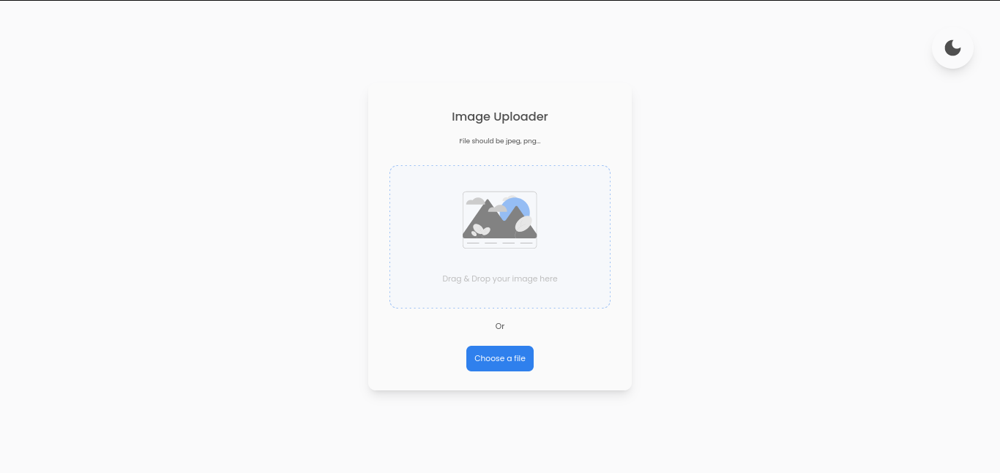

<h1 align="center">Image Uploader</h1>

<div align="center">
   Solution for a challenge from  <a href="http://devchallenges.io" target="_blank">Devchallenges.io</a>.
</div>

<div align="center">
  <h3>
    <a href="https://uploader-image-app.netlify.app/">
      Demo
    </a>
    <span> | </span>
    <a href="https://github.com/Dave136/image-uploader">
      Solution
    </a>
    <span> | </span>
    <a href="https://devchallenges.io/challenges/O2iGT9yBd6xZBrOcVirx">
      Challenge
    </a>
  </h3>
</div>

<!-- TABLE OF CONTENTS -->

## Table of Contents

- [Overview](#overview)
  - [Built With](#built-with)
- [Features](#features)
- [How to use](#how-to-use)
- [Contact](#contact)
- [Acknowledgements](#acknowledgements)

<!-- OVERVIEW -->

## Overview



The simple and minimalist image-uploader app, built using a monorepo system through [pnpm workspaces](https://pnpm.io/workspaces).

You can see a [demo](https://uploader-image-app.netlify.app/)

This project was a fantastic way to remember how to upload files with fastify, use a custom hook for drop functionality, and deploy a monorepo on different platforms.

I added/improved other features like the option to toggle between dark and light mode, an excellent way to communicate any error to the user, and of course, set an image limit size.

I use [react context](https://reactjs.org/docs/context.html) to hold and share the application state and some functions.

### Built With

- [React](https://reactjs.org/)
- [Fastify](https://fastify.io/)
- [Tailwind](https://tailwindcss.com/)

## Features

This application was created as a submission to a [DevChallenges](https://devchallenges.io/challenges) challenge. The [challenge](https://devchallenges.io/challenges/O2iGT9yBd6xZBrOcVirx) was to build an application to complete the given user stories but i added additional features like:

- Dark Mode
- Error page
- Image limit size
- Skeleton loader

## How To Use

To clone and run this application, you'll need [Git](https://git-scm.com), [Node.js](https://nodejs.org/en/download/) (which comes with [npm](http://npmjs.com)) and [Pnpm](https://pnpm.io/installation) installed on your computer. From your command line:

```bash
# Clone this repository
$ git clone https://github.com/Dave136/image-uploader

# Install dependencies
$ pnpm install

# Run the app
$ pnpm dev
```

## Acknowledgements

- [useDrop hook](https://github.com/streamich/react-use/blob/master/src/useDropArea.ts)
- [tailwindcss dark mode docs](https://tailwindcss.com/docs/dark-mode)

## Contact

- Website [dave136.netlify.app](https://dave136.netlify.app/)
- GitHub [@dave136](https://github.com/Dave136)
- Twitter [@davejs4](https://twitter.com/davejs4)
